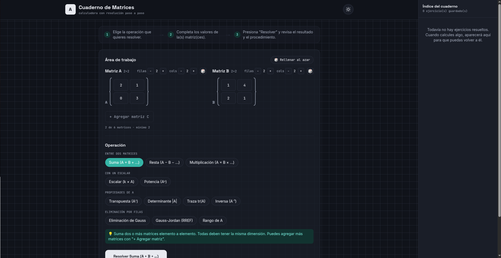

  

Software Engineering Student · Full Stack Developer

Building web applications, interactive tools and software solutions.

---

## About Me

I'm a Software Engineering student from Peru focused on designing and developing software solutions that combine engineering, mathematics and technology.

My main interests are:

- Full Stack Development
- Software Architecture
- Algorithms and Data Structures
- Mathematical Computing
- Artificial Intelligence

Currently developing interactive applications and exploring modern software engineering practices.

---

## Technical Skills

### Programming Languages

  

### Frontend Development

  

### Backend & Databases

  

### Tools & Environment

---

# Featured Project

## Matrix Calculator

### Interactive Matrix Operations Platform

A web application designed to perform, visualize and understand matrix operations through an interactive mathematical interface.

### Main Features

| Feature | Description |
|---|---|
| Matrix Operations | Addition, subtraction and multiplication |
| Mathematical Analysis | Determinants and matrix transformations |
| Step Visualization | Detailed calculation process |
| Responsive Design | Adapted for multiple devices |
| Interactive Interface | Real-time mathematical computation |

 

<table>
<tr>

<td>

</td>

<td>

</td>

</tr>
</table>

---

## Other Projects

| Project | Description |
|---|---|
| VectorLab | Interactive vector field visualization and mathematical analysis platform |
| UNAJ IA | Artificial Intelligence academic project |
| Form Recognition System | Automatic form processing and recognition system |
| Personal Portfolio | Website developed to showcase projects and technical skills |

---

## GitHub Analytics

<table>
<tr>

<td>

</td>

<td>

</td>

</tr>
</table>

 

---

## Development Activity

---

## Contribution Streak

---

## Currently Learning

- React ecosystem
- Software Architecture
- Docker and DevOps practices
- Artificial Intelligence
- Advanced Algorithms

---

## Contact

<table>
<tr>

<td>

</td>

<td>

</td>

<td>

</td>

</tr>
</table>

---

*"Engineering ideas into software solutions."*

